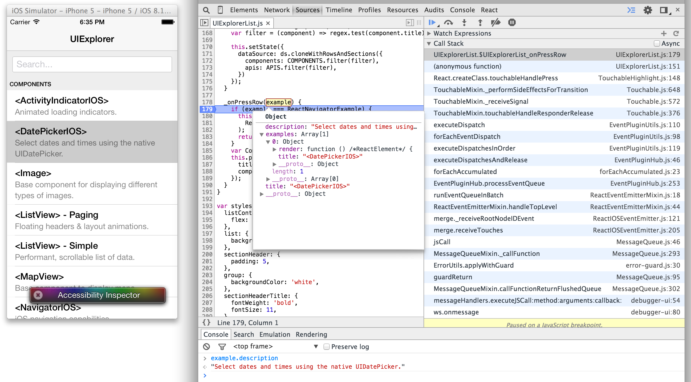

# React Native 官网首页介绍

React Native 使你能够使用基于 JavaScript 和 [React](http://wiki.jikexueyuan.com/project/react/) 一致的开发体验在本地平台上构建世界一流的应用程序体验。React Native 把重点放在所有开发人员关心的平台的开发效率上——开发者只需学习一种语言就能轻易为任何平台高效地编写代码。Facebook 在多个应用程序产品中使用了 React Native，并将继续为 React Native 投资。

[React Native 入门](GettingStarted.md)


## 原生的 iOS 组件 

有了 ReactNative，你可使用标准平台组件，比如 iOS 平台上的 UITabBar 和 UINavigationController。这可以让你的应用程序拥有和原生平台一致的外观和体验，并保持较高的品质。使用相应的 React 组件，如 iOS 标签栏和 iOS 导航器，这些组件可以轻松并入你的应用程序中。

``` 
var React = require('react-native');
var { TabBarIOS, NavigatorIOS } = React;
var App = React.createClass({
  render: function() {
    return (
      <TabBarIOS>
        <TabBarIOS.Item title="React Native" selected={true}>
          <NavigatorIOS initialRoute={{ title: 'React Native' }} />
        </TabBarIOS.Item>
      </TabBarIOS>
    );
  },
});
```

## 异步执行

JavaScript 应用代码和原生平台之间所有的操作都是异步执行，并且原生模块也可以使用额外线程。这意味着我们可以解码主线程图像，并将其在后台保存至磁盘，在不阻塞 UI 的情况下进行文本和布局的估量计算，等等。因此，React Native 应用程序的流畅度和响应性都非常好。通信也是完全可序列化的，当运行完整的应用程序时，这允许我们使用 Chrome Developer Tools 来调试 JavaScript，或者在模拟器中，或者在真机上。

见 [调试](debugging.md)



## 触摸处理 

iOS 有一个非常强大的系统称为 Responder Chain，可以用来响应复杂视图层级中的事件，但是在 Web 中并没有类似功能的工具。React Native 可实现类似的响应系统并提供高水平的组件，比如 TouchableHighlight，无需额外配置即可与滚动视图和其他元素适度整合。

``` 
var React = require('react-native');
var { ScrollView, TouchableHighlight, Text } = React;
var TouchDemo = React.createClass({
  render: function() {
    return (
      <ScrollView>
        <TouchableHighlight onPress={() => console.log('pressed')}>
          <Text>Proper Touch Handling</Text>
        </TouchableHighlight>
      </ScrollView>
    );
  },
});
```

## 弹性框和样式

布局视图应该是简单的，所以我们将 Web 平台上的弹性框模块引入了 React Native。弹性框可用来搭建最常用的 UI 布局，比如代用边缘和填充的堆叠和嵌入。React Native 还支持常见的 Web 样式，比如 fontWeight 和 StyleSheet 抽象，它们提供了一种优化机制来宣称你所有的样式和布局在组件中的应用是正确的，且组件把它们应用到了内网中。

``` 
var React = require('react-native');
var { Image, StyleSheet, Text, View } = React;
var ReactNative = React.createClass({
  render: function() {
    return (
      <View style={styles.row}>
        <Image
          source={{uri: 'http://facebook.github.io/react/img/logo_og.png'}}
          style={styles.image}
        />
        <View style={styles.text}>
          <Text style={styles.title}>
            React Native
          </Text>
          <Text style={styles.subtitle}>
            Build high quality mobile apps using React
          </Text>
        </View>
      </View>
    );
  },
});
var styles = StyleSheet.create({
  row: { flexDirection: 'row', margin: 40 },
  image: { width: 40, height: 40, marginRight: 10 },
  text: { flex: 1, justifyContent: 'center'},
  title: { fontSize: 11, fontWeight: 'bold' },
  subtitle: { fontSize: 10 },
});
```

## Polyfills

React Native 的重点是改变视图代码编写的方式。接下来，我们注意网络中普遍的并把那些 API 放在适当的地方。可以使用 npm 安装 JavaScript 库，这些库用于融入到 React Native 中的顶级功能，比如 XMLHttpRequest，window.requestAnimationFrame 及 navigator.geolocation。我们正在扩大可用的 API，并致力于为开源社区做出贡献。

``` 
var React = require('react-native');
var { Text } = React;
var GeoInfo = React.createClass({
  getInitialState: function() {
    return { position: 'unknown' };
  },
  componentDidMount: function() {
    navigator.geolocation.getCurrentPosition(
      (position) => this.setState({position}),
      (error) => console.error(error)
    );
  },
  render: function() {
    return (
      <Text>
        Position: {JSON.stringify(this.state.position)}
      </Text>
    );
  },
});
```

## 可扩展性 

使用 React Native 无需编写一行原生代码即可创建出一款不错的应用程序，并且 React Native 可通过自定义原生视图和模块来进行扩展--也就是说你可以重用你已经构建的任何内容，并且可导入和使用你最喜欢的原生库。为了在 iOS 中创建一个简单的模块，需要创建一个新的类来实现 RCTBridgeModule 协议，并将你想要在 RCT_EXPORT_METHOD 中对 JavaScript 可用的功能包装起来。另外，类本身必须可以用 RCT_EXPORT_MODULE() 显式导出；

``` 
// Objective-C
 #import "RCTBridgeModule.h"
@interface MyCustomModule : NSObject <RCTBridgeModule>
@end
@implementation MyCustomModule
RCT_EXPORT_MODULE();
// Available as NativeModules.MyCustomModule.processString
RCT_EXPORT_METHOD(processString:(NSString *)input callback:(RCTResponseSenderBlock)callback)
{
  callback(@[[input stringByReplacingOccurrencesOfString:@"Goodbye" withString:@"Hello"];]]);
}
@end
// JavaScript
var React = require('react-native');
var { NativeModules, Text } = React;
var Message = React.createClass({
  render: function() {
    getInitialState() {
      return { text: 'Goodbye World.' };
    },
    componentDidMount() {
      NativeModules.MyCustomModule.processString(this.state.text, (text) => {
        this.setState({text});
      });
    },
    return (
      <Text>{this.state.text}</Text>
    );
  },
});
```

自定义的 iOS 视图可以通过子类化 RCTViewManager，实现 -(UIView *)view 方法并用 RCT_EXPORT_VIEW_PROPERTY 宏导出属性的办法来公开。然后一个简单的 JavaScript 文件会连接这些点。

``` 
// Objective-C
 #import "RCTViewManager.h"
@interface MyCustomViewManager : RCTViewManager
@end
@implementation MyCustomViewManager
- (UIView *)view
{
  return [[MyCustomView alloc] init];
}
RCT_EXPORT_VIEW_PROPERTY(myCustomProperty);
@end
// JavaScript
module.exports = createReactIOSNativeComponentClass({
  validAttributes: { myCustomProperty: true },
  uiViewClassName: 'MyCustomView',
});
```


[React Native 入门](getting-started.md)