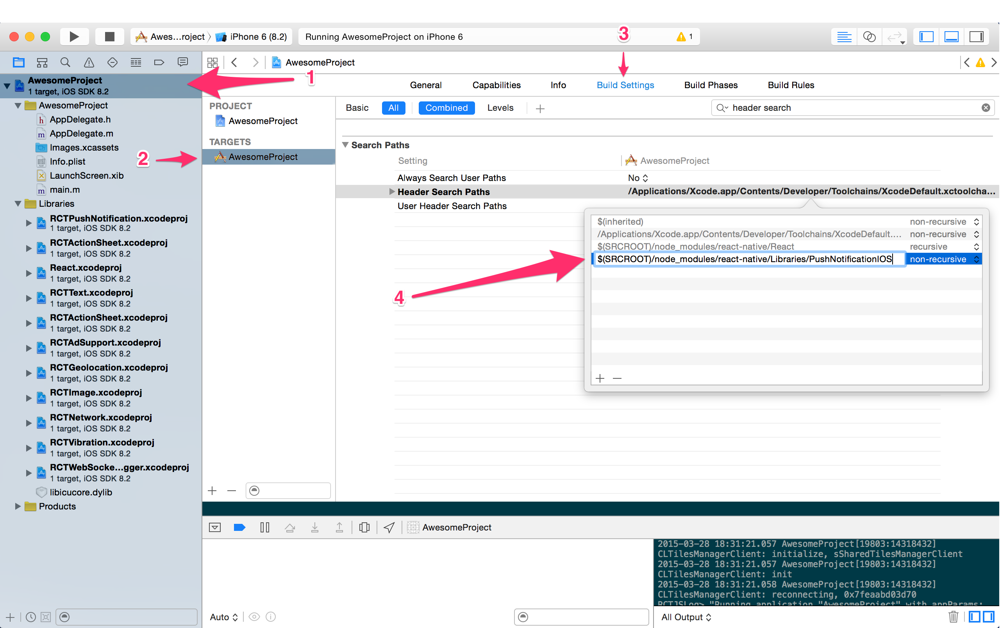

# 链接库

不是每个应用程序都使用所有的 native 功能，也不是包含支持这些特性的代码就会影响二进制大小...但是我们仍然想在你需要它们的时候添加这些特性变得容易。

记住我们把这些特性作为独立的静态库公开。

对于大多数的 libs 来说，它就像拖两个文件一样简单，有时第三步将是必要的,但仅此而已。

我们用 React Native 推出的所有的库存在在根仓库的 `Libraries` 文件夹中。它们中的一些是纯粹的 JavaScript，您只需要 `require` 它。其他的 libraries 也依赖于一些 native 代码，在这种情况下你需要将这些文件添加到你的应用程序中，否则当你尝试使用 library 时，程序将抛出一个错误。

## 这几个步骤来链接包含 native 代码的库

### 步骤 1

如果库有 native 代码，那么在它的文件夹必须有一个 `.xcodeproj` 文件。拖动这个文件到 Xcode 项目中(通常在 Xcode 的 `Libraries` 小组)；

### 步骤 2

点击你的主项目文件(代表 `.xcodeproj` 的文件)选择 `Build Phases`，从你正在导入 `Link Binary With Libraries` 的库中的 `Products` 文件夹中，拖动静态库。

### 步骤 3

不是每个库都需要这一步，你需要考虑的是：

*我在编译时需要知道库的内容吗？*

这意味着，你是在 native 网站中使用库还是只是在 JavaScript 中使用库呢？如果你只是在 JavaScript 中使用它，这样做很好!

对于我们用除了 `PushNotificationIOS` 和 `LinkingIOS` 的 React Native 推出的库来说，这个步骤是不必要的。

以 `PushNotificationIOS` 为例，每次你收到一个新的 push notifiation，你必须从 `AppDelegate` 的库中调用方法。

为此，我们需要知道库的头。为了实现这个，你必须在你的项目文件中选择 `Build Settings`，搜索 `Header Search Paths`。你应该包括通往库的路径(如果有相关文件的子目录，记得使它 `recursive`，如例子中的 `React`)。

